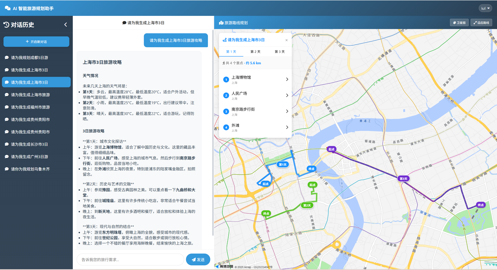
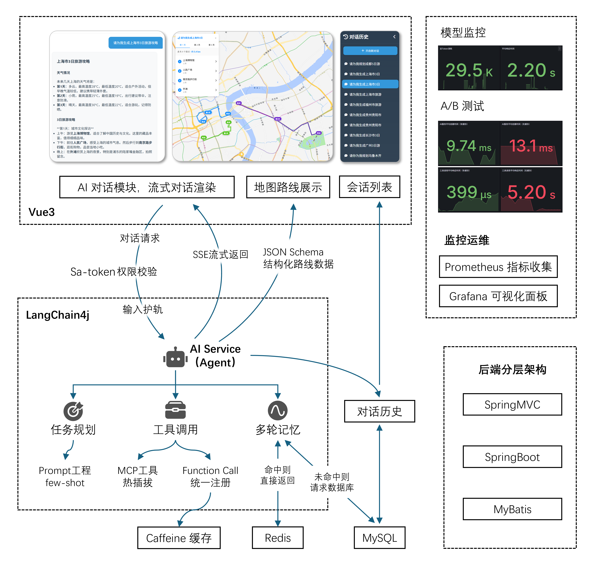
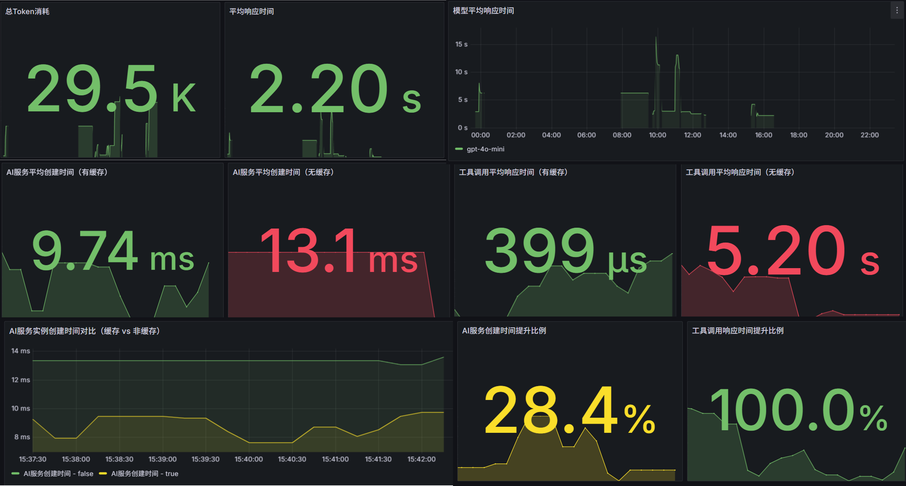

# AI 智能旅游规划助手（后端）

> 访问地址：[https://www.aitrip.chat/](https://www.aitrip.chat/)  
> 欢迎体验智能旅游规划服务！

## 📖 项目简介

  AI-Tourism 是一个智能旅游规划系统，后端基于 **Spring Boot、LangChain4j、MySQL、MyBatis、Sa-Token** 等技术栈构建。

  系统集成了多种 AI 能力（如 AI Service、MCP 工具等），为用户提供**个性化旅游路线推荐、多轮对话、权限控制**等功能。

  **核心特性**包括：
  - 多轮对话与上下文记忆
  - 地图路线可视化
  - 安全认证与权限管理
  - MCP 灵活热插拔 与 Tool 统一注册

---

### AI 智能旅游规划 前端效果截图：


## 视频效果


---

## 💡 核心特性与架构特点



### 1. Agent 服务与地图路线渲染深度结合
  - 提供图文结合的旅游攻略，并在前端地图中直观展示每日路线。
  - 使用 SSE 流式传输文字版攻略，并基于 JSON Schema 输出结构化数据，支持前端实时渲染。

### 2. 基于 Langchain4j 的 Agent 服务
- **任务规划**：基于 Prompt 工程，设计角色定位 + 任务目标 + 约束限制。
- **工具调用**：MCP 工具通过配置可灵活启用/禁用，支持热插拔；所有 Tool 工具均实现统一接口，注册到 ToolManager，支持运行时动态扩展与管理。
- **多轮记忆**：实现 ChatMemoryStore，短期记忆优先存储于 Redis，未命中自动回退数据库，AI Service 实例以会话为单位缓存，支持多用户并发与上下文隔离。
- **结构化输出路线**：基于 JSON Schema 输出结构化路线数据，用于前端地图渲染展示。
- **安全防范**：LangChain4j 输入护轨机制，前置校验请求内容，防止敏感词与 Prompt 注入攻击，保障系统稳定性。

### 3. 统一工具注册与高性能调用防抖
  - MCP 工具通过配置可灵活启用/禁用，支持热插拔。
  - 所有 Function Call 工具通过 ToolManager 统一注册与调度，支持运行时扩展。
  - 引入 Caffeine 缓存，避免重复调用外部服务，平均响应耗时从 5.20s 下降至 399μs。

### 4. 多轮对话记忆与实例隔离
  - 结合 Redis 与数据库实现短期记忆，使用数据库实现会话历史。
  - 基于 Caffeine 缓存 AI Service 实例，支持会话隔离，提升服务响应性能并减少实例重复创建。实例平均创建时间由 13.1ms 降低至 9.74ms，性能提升 28.4%。

### 5. AI 输入护轨与结构化输出
  - 请求前置校验，自动过滤敏感词、恶意注入等风险内容，保障系统安全。

### 6. Sa-Token 权限认证
  - JWT 短期令牌 + Refresh Token 长期令牌结合。
  - 注解式权限控制，细粒度角色管理。

### 7. SpringBoot 工程化与 RESTful 设计
  - 标准的分层架构（Controller - Service - Mapper）。
  - 接口统一，符合 RESTful 规范，易于前后端协作。

---

## 🏗️ 系统整体架构

> 

**架构说明：**

- **前端**：负责用户交互、地图渲染、AI 对话展示。
- **API 控制层**：统一入口，负责请求分发、权限校验。
- **AI Agent 服务层**：基于 LangChain4j，负责多轮对话、工具调用、上下文记忆。
- **工具管理与缓存层**：ToolManager 统一注册与调度工具，Caffeine 缓存防抖，Redis 管理会话记忆。
- **业务服务层**：用户、权限、会话、消息等业务逻辑。
- **数据持久化层**：MySQL 存储用户、角色、权限、会话、消息等。
- **监控与日志**：Prometheus + Grafana 实时监控，SLF4j 日志追踪。

---

## 🚀 快速开始

### 📂 目录结构

```
ai-tourism/
├── src/
│   ├── main/
│   │   ├── java/com/example/aitourism/
│   │   │   ├── ai/                  # AI Agent、工具、记忆、护轨等核心AI能力
│   │   │   ├── config/              # 配置类（如Sa-Token、CORS、Redis等）
│   │   │   ├── controller/          # REST API 控制器
│   │   │   ├── dto/                 # 数据传输对象
│   │   │   ├── entity/              # 实体类
│   │   │   ├── exception/           # 全局异常处理
│   │   │   ├── mapper/              # MyBatis 映射
│   │   │   ├── monitor/             # 监控与埋点
│   │   │   ├── service/             # 业务逻辑与AI集成
│   │   │   └── util/                # 工具类
│   │   └── resources/
│   │       ├── application.yml      # 主要配置文件
│   │       └── prompt/              # AI Prompt 模板
├── sql/
│   └── create_table.sql             # 数据库表结构
├── doc/
│   ├── API.md                       # 接口文档
│   └── Prometheus-Grafana.json      # 监控仪表盘配置
├── pom.xml                          # Maven 依赖
└── README.md
```

### 🛠️ 技术栈与依赖

- Java 21
- Spring Boot 3.5.6
- LangChain4j（AI能力集成）
- MySQL 9.4
- MyBatis & MyBatis-Spring-Boot
- Sa-Token（JWT 认证与权限）
- BCrypt（密码加密）
- Lombok
- OkHttp3
- Caffeine（本地高性能缓存）
- Redis（分布式缓存与对话记忆）
- Hutool（工具库）
- Prometheus + Grafana（监控与可视化）
- Micrometer（Spring Boot 监控埋点）

> 详见 `pom.xml` 依赖配置。

### 🗄️ 数据库结构

主要表设计如下：

- `t_user`：用户表（含手机号、加密密码、昵称、头像、状态等）
- `t_role`：角色表（如 USER、ROOT）
- `t_permission`：权限表
- `t_user_role`：用户-角色关联表
- `t_role_permission`：角色-权限关联表
- `t_refresh_token`：刷新令牌表
- `t_ai_assistant_sessions`：AI助手会话表
- `t_ai_assistant_chat_messages`：AI助手消息表

> 详细字段和约束请参考 `sql/create_table.sql`。

### ⚙️ 配置说明

主要配置项在 `src/main/resources/application.yml`：

- 端口、数据库连接、日志、MyBatis、Sa-Token、OpenAI/MCP 等 AI 服务参数
- Sa-Token JWT 密钥、token 过期时间、权限注解等
- MCP 工具裁剪、AI模型参数等

### 🔗 接口说明

#### 用户与认证相关
- `POST /auth/login`：用户登录，返回 token、用户信息等
- `POST /auth/register`：用户注册，自动分配 USER 角色
- `GET /auth/me`：获取当前用户信息及角色
- `POST /auth/refresh`：刷新 token，提升安全性与体验
- `POST /auth/logout`：登出，清理会话
- `POST /auth/disable`：禁用用户（需权限）
- `POST /auth/set_root`：ROOT 授权（需权限）

#### AI 助手相关
- `POST /ai_assistant/chat`：发起 AI 流式对话，返回旅游路线建议
- `POST /ai_assistant/get_history`：获取会话历史，支持多轮追溯
- `POST /ai_assistant/session_list`：获取历史会话列表，分页展示

> 详细参数与返回格式请参考 `doc/API.md`。

---

## 🔒 认证与权限机制

- 使用 Sa-Token + JWT 认证。
- 支持注解式权限控制（如 `@SaCheckLogin`, `@SaCheckPermission`），多角色、细粒度权限分配。
- 密码加密存储（BCrypt）。
- 通过数据库灵活配置角色与权限，支持动态扩展。

---

## 📊 监控与可观测性（Prometheus + Grafana）

系统已集成 Prometheus + Grafana 实现全链路监控，覆盖 AI 服务调用、工具缓存命中、Token 消耗、响应耗时、错误率等核心指标。

- **监控内容：**
    - AI模型总请求数、成功率、平均响应时间、Token消耗趋势。
    - AI Service 实例创建时间对比（缓存/非缓存）。
    - 工具缓存命中率、调用响应时间对比（缓存/非缓存）。
    - 用户/会话活跃排行、错误类型分布等。

- **Grafana 大盘截图：**



> 可参考 `doc/Prometheus-Grafana.json` 配置文件。*

---

## 🤖 AI 能力集成与多轮对话

- 支持 OpenAI compatible LLM、MCP 工具、Function Call 等。
- AI 旅游助手具备：
  - 天气查询、景点推荐、路线规划。
  - 智能裁剪与摘要，自动结构化输出。
  - 工具调用与异常兜底。
- 工具注册与调用：
  - 所有 AI 工具均实现统一接口，注册到 ToolManager，支持运行时动态扩展与管理。
  - 工具调用结果采用 Caffeine 缓存，防止 LLM 重复请求外部服务，极大提升响应速度。
- 多轮对话记忆：
  - ChatMemoryStore 结合 Redis 管理短期记忆，未命中自动回退数据库，兼顾性能与数据安全。
  - AI Service 实例以会话为单位缓存，支持多用户并发与上下文隔离。
- 安全与结构化输出：
  - LangChain4j 输入护轨机制，前置校验请求内容，防止敏感词与 Prompt 注入攻击。
  - 结合 Prompt few-shot 与 JSON Schema，输出结构化路线数据，前端可直接用于地图渲染。
- 多轮对话：
  - 每次对话均带有 sessionId，短期记忆在内存，长期记忆（历史会话、消息）存储于数据库。
  - 支持上下文追溯，提升对话连贯性。
- MCP 工具热插拔：
  - 工具注册与启用通过配置文件灵活管理。
  - 支持未来扩展更多 AI 工具。
- Token 超限防护：
  - JDK 动态代理拦截输出，ToolProvider 包装器二次截断。
  - 智能摘要，保障响应内容不超限。

---

## 🛫 部署与运行

1. 安装 JDK 21、Maven、MySQL 8.x
2. 初始化数据库（执行 `sql/create_table.sql`）
3. 配置 `application.yml` 数据库、AI api-Key 等参数
4. 构建并运行：
   ```bash
   mvn clean package
   java -jar target/ai-tourism-0.0.1-SNAPSHOT.jar
   ```
5. 前端请参考 [ai-tourism-frontend 仓库](https://github.com/1937983507/ai-tourism-frontend)

---

## 🖼️ 示例效果

> 
> 

---

## 📬 联系与贡献

欢迎任何建议、反馈与贡献！如需交流或有合作意向，欢迎通过以下方式联系：

- 微信：vx 13859211947
- 提交 Issue 或 PR 到本仓库
- 也欢迎访问前端项目：[ai-tourism-frontend 仓库](https://github.com/1937983507/ai-tourism-frontend)

如有 Bug、需求或想法，欢迎随时提出，我们会积极响应。

---

## 📝 License

本项目仅供学习使用，**禁止未经授权的商用**。

---

## TODO list

1、将结果导出为 h5 页面，然后手机扫码展示。
2、将调用的工具也一起在前端渲染显示。
3、左侧历史会话支持置顶、取消置顶、修改标题。
4、可以提供更多的 MCP 服务，例如图片检索之类.
5、对于某一城市的景点内容，可以存储在向量数据库中，若是能检索到则直接交给大模型输出；若是检索不到则调用MCP服务进行检索。
6、对话框集成示例 prompt，用户可以直接选择，并修改部分细节即可发起请求。