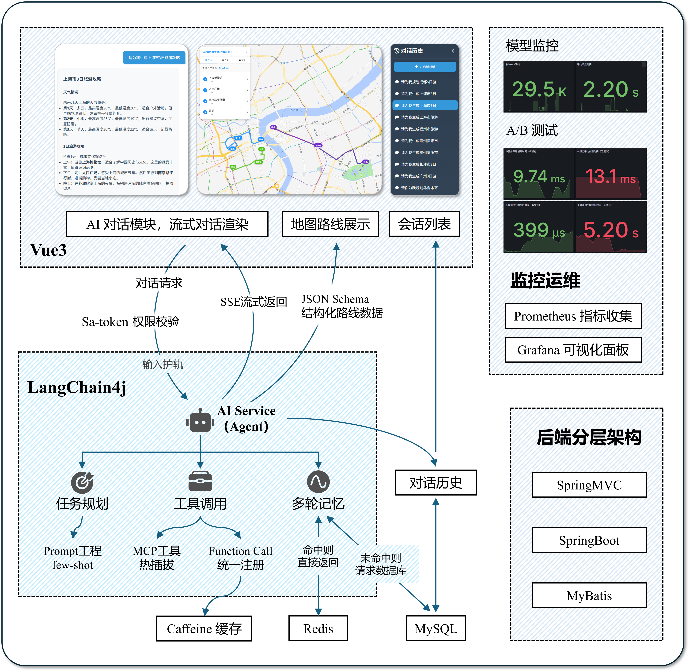

# AI 智能旅游规划助手（后端）

> **访问地址**：[https://www.aitrip.chat/](https://www.aitrip.chat/)  
> **欢迎体验智能旅游规划服务！**

## 📖 项目简介

**AI-Tourism** 是一个智能旅游规划系统，后端基于 **Spring Boot、LangChain4j、MySQL、MyBatis、Sa-Token** 等技术栈构建。

系统集成了多种 AI 能力（如 AI Service、MCP 工具等），为用户提供**个性化旅游路线推荐、多轮对话、权限控制**等功能。

### 🎯 核心特性
- **多轮对话与上下文记忆** - 智能理解用户需求，保持对话连贯性
- **地图路线可视化** - 实时展示旅游路线，直观易懂
- **MCP 灵活热插拔** - 工具可动态启用/禁用，支持热插拔
- **Tool 统一注册** - 所有工具统一管理，易于扩展
- **安全认证与权限管理** - 完善的用户权限体系

---

### 🖼️ AI 智能旅游规划 前端效果截图


### 📹 视频效果


**AI 智能旅游规划系统**，结合 `SpringBoot` 与 `LangChain4j`，在用户输入自然语言后，由 **AI Agent** 调用 **MCP 工具**与 **Function Call** 获取天气、景点等信息，由前端同时渲染文字版路线规划与结构化地图路线。

---

## 💡 核心特性与架构特点



### 1. Agent 服务与地图路线渲染深度结合
- **图文结合**：提供图文结合的旅游攻略，并在前端地图中直观展示每日路线
- **流式传输**：使用 `SSE` 流式传输文字版攻略，并基于 `JSON Schema` 输出结构化数据，支持前端实时渲染

### 2. 基于 Langchain4j 的 Agent 服务
- **任务规划**：基于 `Prompt` 工程，设计角色定位 + 任务目标 + 约束限制
- **工具调用**：`MCP` 工具通过配置可灵活启用/禁用，支持热插拔；所有 `Tool` 工具均实现统一接口，注册到 `ToolManager`，支持运行时动态扩展与管理
- **多轮记忆**：实现 `ChatMemoryStore`，短期记忆优先存储于 `Redis`，未命中自动回退数据库，`AI Service` 实例以会话为单位缓存，支持多用户并发与上下文隔离
- **结构化输出路线**：基于 `JSON Schema` 输出结构化路线数据，用于前端地图渲染展示
- **安全防范**：`LangChain4j` 输入护轨机制，前置校验请求内容，防止敏感词与 `Prompt` 注入攻击，保障系统稳定性

### 3. 统一工具注册与高性能调用防抖
- **MCP 工具**：通过配置可灵活启用/禁用，支持热插拔
- **Function Call 工具**：通过 `ToolManager` 统一注册与调度，支持运行时扩展
- **性能优化**：引入 `Caffeine` 缓存，避免重复调用外部服务，**平均响应耗时从 5.20s 下降至 399μs**

### 4. 多轮对话记忆与实例隔离
- **记忆管理**：结合 `Redis` 与数据库实现短期记忆，使用数据库实现会话历史
- **实例缓存**：基于 `Caffeine` 缓存 `AI Service` 实例，支持会话隔离，提升服务响应性能并减少实例重复创建
- **性能提升**：实例平均创建时间由 **13.1ms 降低至 9.74ms，性能提升 28.4%**

### 5. AI 输入护轨与结构化输出
- **安全校验**：请求前置校验，自动过滤敏感词、恶意注入等风险内容，保障系统安全

### 6. Sa-Token 权限认证
- **令牌机制**：`JWT` 短期令牌 + `Refresh Token` 长期令牌结合
- **权限控制**：注解式权限控制，细粒度角色管理

### 7. SpringBoot 工程化与 RESTful 设计
- **分层架构**：标准的分层架构（`Controller` - `Service` - `Mapper`）
- **接口规范**：接口统一，符合 `RESTful` 规范，易于前后端协作

---

## 🏗️ 系统整体架构


- **前端（ai-tourism-frontend）**：`Vue` 应用，负责交互、地图渲染与对话展示；通过 `SSE` 调用 `POST /ai_assistant/chat-stream` 实时消费模型输出

- **接入层（Controller + 鉴权）**：基于 `Spring Boot REST`，使用 `Sa-Token` 进行登录与权限校验（如 `@SaCheckLogin`、`@SaCheckPermission`）

- **服务层（MemoryChatServiceImpl）**：统一处理请求校验、获取会话历史、获取会话列表、消息入库、`SSE` 流式返回

- **AI Service（MemoryAssistantServiceFactory）**：按会话构建隔离的 `AssistantService` 实例，整合 `OpenAI` 流式模型、`MessageWindowChatMemory`（基于 `ChatMemoryStore`）、输入护轨、工具调用；同时使用 `Caffeine` 按 `sessionId` 缓存实例，避免重复创建

- **记忆与历史（Redis + MySQL）**：
  - **短期对话记忆**：`CustomRedisChatMemoryStore` 基于 `Redis` 进行管理，同时支持 `MySQL` 消息填入
  - **长期历史与结构化数据**：通过 `MyBatis` 写入 `MySQL`（会话表、消息表、路线 JSON）

- **工具调用（Function Call + MCP）**：
  - **Function Call**：`ToolManager` 统一注册所有 `BaseTool`
  - **MCP**：基于 `LangChain4j MCP`，`McpClientService` 通过 `SSE` 创建 `ToolProvider`

- **缓存与防抖**：
  - **Caffeine**：缓存 `AssistantService` 实例
  - **Redis**：承载对话记忆，降低数据库读写压力

- **可观测性与监控**：`Micrometer`` 暴露 `Prometheus` 指标（管理端点已开放 `prometheus`）；`AiModelMonitorListener`/`AiModelMetricsCollector` 记录请求量、耗时、Token 使用、错误率、缓存命中等；Grafana 仪表盘见 `doc/Prometheus-Grafana.json`

---

## 🚀 快速开始

### 📂 目录结构

```
ai-tourism/
├── src/
│   ├── main/
│   │   ├── java/com/example/aitourism/
│   │   │   ├── ai/                  # AI Agent、工具、记忆、护轨等核心AI能力
│   │   │   ├── config/              # 配置类（如Sa-Token、CORS、Redis等）
│   │   │   ├── controller/          # REST API 控制器
│   │   │   ├── dto/                 # 数据传输对象
│   │   │   ├── entity/              # 实体类
│   │   │   ├── exception/           # 全局异常处理
│   │   │   ├── mapper/              # MyBatis 映射
│   │   │   ├── monitor/             # 监控与埋点
│   │   │   ├── service/             # 业务逻辑与AI集成
│   │   │   └── util/                # 工具类
│   │   └── resources/
│   │       ├── application.yml      # 主要配置文件
│   │       └── prompt/              # AI Prompt 模板
├── sql/
│   └── create_table.sql             # 数据库表结构
├── doc/
│   ├── API.md                       # 接口文档
│   └── Prometheus-Grafana.json      # 监控仪表盘配置
├── pom.xml                          # Maven 依赖
└── README.md
```

### 🛠️ 技术栈与依赖

| 技术分类 | 技术栈 | 版本/说明 |
|---------|--------|----------|
| **核心框架** | Java | `21` |
| | Spring Boot | `3.5.6` |
| **AI 能力** | LangChain4j | AI能力集成 |
| **数据库** | MySQL | `9.4` |
| **ORM** | MyBatis & MyBatis-Spring-Boot | 数据持久化 |
| **安全认证** | Sa-Token | JWT 认证与权限 |
| | BCrypt | 密码加密 |
| **工具库** | Lombok | 代码简化 |
| | OkHttp3 | HTTP 客户端 |
| | Hutool | 工具库 |
| **缓存** | Caffeine | 本地高性能缓存 |
| | Redis | 分布式缓存与对话记忆 |
| **监控** | Prometheus + Grafana | 监控与可视化 |
| | Micrometer | Spring Boot 监控埋点 |

> **详见** `pom.xml` 依赖配置

### 🗄️ 数据库结构

#### 主要表设计

| 表名 | 说明 | 主要字段 |
|------|------|----------|
| `t_user` | 用户表 | 手机号、加密密码、昵称、头像、状态等 |
| `t_role` | 角色表 | USER、ROOT 等角色 |
| `t_permission` | 权限表 | 权限标识、权限名称等 |
| `t_user_role` | 用户-角色关联表 | 用户ID、角色ID |
| `t_role_permission` | 角色-权限关联表 | 角色ID、权限ID |
| `t_refresh_token` | 刷新令牌表 | 用户ID、令牌值、过期时间等 |
| `t_ai_assistant_sessions` | 会话列表 | 会话ID、用户ID、会话标题等 |
| `t_ai_assistant_chat_messages` | AI助手消息表 | 消息ID、会话ID、消息内容、角色等 |

> **详细字段和约束**请参考 `sql/create_table.sql`

### ⚙️ 配置说明

主要配置项在 `src/main/resources/application.yml`：

- **基础配置**：端口、数据库连接、日志、MyBatis 等
- **安全认证**：Sa-Token JWT 密钥、token 过期时间、权限注解等  
- **AI 服务**：OpenAI/MCP 等 AI 服务参数

### 🔗 接口说明

#### 用户与认证相关

| 接口 | 方法 | 说明 |
|------|------|------|
| `/auth/login` | `POST` | 用户登录，返回 token、用户信息等 |
| `/auth/register` | `POST` | 用户注册，自动分配 USER 角色 |
| `/auth/me` | `GET` | 获取当前用户信息及角色 |
| `/auth/refresh` | `POST` | 刷新 token，提升安全性与体验 |
| `/auth/logout` | `POST` | 登出，清理会话 |
| `/auth/disable` | `POST` | 禁用用户（需权限） |
| `/auth/set_root` | `POST` | ROOT 授权（需权限） |

#### AI 助手相关

| 接口 | 方法 | 说明 |
|------|------|------|
| `/ai_assistant/chat` | `POST` | 发起 AI 流式对话，返回旅游路线建议 |
| `/ai_assistant/get_history` | `POST` | 获取会话历史，支持多轮追溯 |
| `/ai_assistant/session_list` | `POST` | 获取历史会话列表，分页展示 |

> **详细参数与返回格式**请参考 `doc/API.md`

---


## 📊 监控与可观测性（Prometheus + Grafana）

系统已集成 **Prometheus + Grafana** 实现全链路监控，覆盖 AI 服务调用、工具缓存命中、Token 消耗、响应耗时、错误率等核心指标。

### 1. 数据采集
- **指标采集**：使用 `Micrometer` 指标采集门面库，它集成在 `Spring Boot Actuator` 中。`Micrometer` 提供了一套统一的 API 来定义和记录指标，并且能够将这些指标转换为多种监控系统所需的格式，其中就包括 `Prometheus`
- **指标定义**：创建了一个 `AiModelMetricsCollector` 类，在其中使用 `Micrometer API` 定义核心业务指标，主要包括：
  - **Counter**：用于统计累计值，如 AI 请求总数、Token 消耗总量、错误总数
  - **Timer**：用于记录耗时分布，如 AI 响应时长
- **监听机制**：实现 `ChatModelListener` 接口，重写 `onRequest`、`onResponse`、`onError` 等方法，用于监听对应的关键事件，然后在其中调用 `AiModelMetricsCollector` 来实时记录定义的指标
- **端点暴露**：`Spring Boot Actuator` 会自动创建一个 `/actuator/prometheus` 端点，将 `Micrometer` 采集的所有指标以 `Prometheus` 要求的文本格式暴露出来

### 2. 数据存储
- **Prometheus 配置**：需要部署独立的 `Prometheus` 服务，在其配置文件中添加抓取任务，让其定期抓取后端应用暴露的 `/actuator/prometheus` 端点的数据
- **配置示例**：
  ```yaml
  - job_name: "ai-tourism"
    metrics_path: '/actuator/prometheus'
    scrape_interval: 10s
    static_configs:
      - targets: ["localhost:8290"]
        labels:
          group: "prod"
          endpoint: "actuator"
  ```
- **数据存储**：`Prometheus` 会将这些时序数据高效地存储在它内置的 `TSDB` 时序数据库中

### 3. 数据展示
- **Grafana 连接**：在 `Grafana` 中连接 `Prometheus` 服务数据
- **仪表盘创建**：创建了一个自定义的监控仪表盘，通过编写 `PromQL` 查询语句，将存储在 `Prometheus` 中的原始指标数据聚合成有意义的可视化图表

### 4. 监控内容
- **AI 模型指标**：总请求数、成功率、平均响应时间、Token 消耗趋势
- **性能对比**：AI Service 实例创建时间对比（缓存/非缓存）
- **缓存效果**：工具缓存命中率、调用响应时间对比（缓存/非缓存）
- **用户活跃**：用户/会话活跃排行、错误类型分布等

### 5. Grafana 大盘截图


> **具体 Grafana 配置**可参考 `doc/Prometheus-Grafana.json` 配置文件

---

## 🛫 部署与运行

### 📋 环境要求
1. **JDK 21** - Java 运行环境
2. **Maven** - 项目构建工具
3. **MySQL 9.4** - 数据库
4. **Redis 3.0** - 缓存服务

### 🚀 部署步骤

#### 1️. 环境准备
```bash
# 安装 JDK 21
# 安装 Maven
# 安装 MySQL 9.4
# 安装 Redis 3.0
```

#### 2️. 数据库初始化
```bash
# 执行数据库初始化脚本
mysql -u root -p < sql/create_table.sql
```

#### 3️. 配置文件
编辑 `src/main/resources/application.yml`：
- 配置数据库连接信息
- 配置 AI API Key
- 配置其他必要参数

#### 4️. 构建运行
```bash
# 构建项目
mvn clean package

# 运行项目
java -jar target/ai-tourism-0.0.1-SNAPSHOT.jar
```

#### 5️. 前端部署
前端请参考 [ai-tourism-frontend 仓库](https://github.com/1937983507/ai-tourism-frontend)

---

## 📬 联系与贡献

欢迎任何建议、反馈与贡献！如需交流或有合作意向，欢迎通过以下方式联系：

- **微信**：`vx 13859211947`
- **GitHub**：提交 Issue 或 PR 到本仓库
- **前端项目**：[ai-tourism-frontend 仓库](https://github.com/1937983507/ai-tourism-frontend)

如有 Bug、需求或想法，欢迎随时提出，我们会积极响应。

---

## 📝 License

本项目仅供学习使用，**禁止未经授权的商用**。

---

## 📋 TODO list

- [ ] 左侧历史会话支持置顶、取消置顶、修改标题
- [ ] 可以提供更多的 MCP 服务，例如图片检索之类
- [ ] 将结果导出为 h5 页面，然后手机扫码展示
- [ ] 将调用的工具也一起在前端渲染显示
- [ ] 引入 **RAG**，对于某一城市的景点内容，可以存储在向量数据库中，若是能检索到则直接交给大模型输出；若是检索不到则调用MCP服务进行检索
- [ ] 对话框集成示例 prompt，用户可以直接选择，并修改部分细节即可发起请求
- [ ] 对话过程中，可以直接终止本次对话
- [ ] 可以对以往发起的对话内容编辑，然后重新对话
- [ ] 引入 **LangGraph4j**，解决直接调用 AI Service 时存在的流程不可控、任务耦合度高、扩展性较差的问题
  - **流程不可控**：所有的过程都被封装到单一的AI服务中，很难干预其中间过程。（例如我希望它先进行天气查询、然后进行景点查询、然后搜寻景点的照片，这样一个流程，难以控制与干预）
  - **任务耦合**：将逻辑上独立的步骤，都耦合在一个巨大的系统提示词里面，不仅使得提示词难以维护与异常复杂、同时增加了AI理解和执行任务的难度
  - **扩展性差**：若是想在流程中添加新的步骤，则在目前的模式下只能通过修改系统提示词进行解决
- [ ] Redis 部分的扩展补充
- [ ] 通过 **Redisson** 实现分布式限流，防止恶意请求和资源滥用

---

## 📚 核心基础代码

含有 **AI Service、MCP、Function Call** 调用基础核心代码

> **可参考** `doc/coreBasicCode.md` 文件
